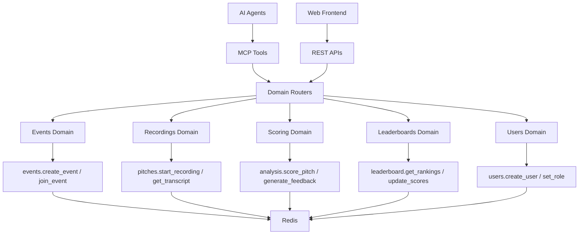
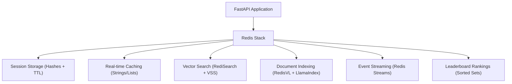

## Part 1: MCP-AI Hackathon Challenge

What type of MCP can you build in 7 hours at the [MCP - AI Agents Hackathon](https://juniper-giant-a3f.notion.site/MCP-AI-Agents-Hackathon-Sep-19-11c9fb250b4b80c488b7e2d7b6d6816d) in San Francisco on Sep 19, 2025. **Goal: Make a fully MCP application with Redis for rapid development.**

We built **PitchScoop**, the AI scoop on your pitch. It is an AI Pitch Judge and Coach, powered by MCP where AI agents judge and score pitch events, update leaderboards, and give users feedback on content, presentation flow and style.

**How it works:**
person logs in → create/join an event → record your pitch → AI score analysis from transcript → leaderboard → team pages with feedback → chat with transcripts → measure pitch progression over time

From the start, we challenged ourselves to run every part of the app through MCP. The hackathon ran from 9:30 AM to 4:30 PM, giving us about seven hours of focused development time.

**PitchScoop went on to win the First Place Grand Prize as well as Best Use Case of Redis.** There were over 200 people and 70 project submissions. Here's what we learned about combining MCP with Redis Stack for rapid prototyping.

## Part 2: Technical Deep Dive of MCP

### What is MCP?

**Model Context Protocol (MCP)** is a standard way for an application to publish a small, well-described menu of actions and data through an MCP server. Any MCP-compatible client (for example, Claude) can discover that menu and call those actions.

Many people say it is the "USB-C of AI", but that really means nothing to me. How I understand MCP is it lets me publish a single list of AI compatible "things my app can do" and how MCP-compatible clients can call those things directly.

**How MCPs compare to traditional APIs:** With a traditional API, integrators handle auth, request shapes, parsing, and errors. MCP reduces that work by standardizing how capabilities are described and called. You publish functions as tools on an MCP server, and MCP-compatible clients can discover and use them. You still handle authentication and permissions, but there is far less custom glue.

**Why MCP matters:** MCP standardizes how apps expose and call capabilities. That shared interface lets agents and services work across products with less glue code and faster integrations.

### Breaking Down PitchScoop

For this hackathon we decided to go all in on MCP. For the backend, we took an **MCP-first** approach, building every feature as an AI-callable tool with Python FastAPI and strict **Domain-Driven Design** principles.

Once those tools were in place, we added REST endpoints to support our standalone TypeScript frontend. PitchScoop is organized into five domains, each with its own router, models, and business logic.

Users can either interact directly through our frontend UI, or leverage the PitchScoop MCP tools, which transform Claude Desktop into a sophisticated AI judge assistant that delivers instant, professional-quality pitch analysis through natural conversation.

**The MCP-Redis Connection:** Each MCP tool interacts with Redis Stack to store and retrieve data. For example, the `analysis.score_pitch` tool gets transcripts from Redis, performs AI analysis, then stores results back to Redis. The `leaderboard.update_scores` tool uses Redis Sorted Sets to maintain live rankings. This tight integration means MCP tools have instant access to sessions, cached data, search results, and real-time updates.

### Why MCP Made Technical Sense for PitchScoop

Building PitchScoop with MCP tools alongside our web UI and REST APIs gave judges a completely different way to interact with our scoring system:

- Judges can get analysis through natural conversation instead of clicking through UI screens
- Complex queries like "compare the top 3 teams" happen instantly via chat
- AI agents can chain multiple scoring operations together automatically
- Judges working in Claude Desktop never have to switch contexts or learn our interface
- PitchScoop could easily be integrated into any hackathon instead of our application

The result? Users can access pitch analysis in two ways: through the traditional web interface or via conversational AI, which delivers both quick insights and deep analysis.

### MCP and APIs

Even though our core business logic lives in MCP tools, the frontend still needs a traditional API to interact with. That's why we built REST endpoints as wrappers around MCP. The endpoint receives a request from the frontend, calls the underlying MCP tool, and then transforms the raw MCP response into a structured format with Pydantic models. This way, AI agents can call the MCP tool directly, while the frontend gets a predictable REST interface.

## Part 3: Redis Deep Dive

PitchScoop needed to handle real-time transcription, AI analysis, leaderboards, and session state. Normally this would require a mix of databases, caches, and search engines. Redis Stack provided the foundation to bring all of this together in one place.

**Redis is often seen as a tool for caching, but it is far more powerful.**

With JSON, search, vector similarity, and real-time data structures, it became the backbone of the application. The result was a leaner architecture, lower latency, and faster prototyping at the hackathon.

### Why Redis Sorted Sets Over Python Lambda Sorting

When building our live competition leaderboard, we needed updates to be instant. Judges score a pitch, and everyone should immediately see the new rankings.

We could have used Python lambda sorting, but that meant pulling all the team data out of storage, sorting it again, and sending it back every time someone checked the leaderboard. As scores piled up, this could get slow. Instead, we used Redis Sorted Sets. They automatically keep everything ranked as scores change. The moment a team's score is updated, the leaderboard is already in order with no extra work required.

For a live event, this gave us the real-time responsiveness we needed, with the rankings updating instantly after every pitch.

## Part 4: Results and Lessons Learned

### What We Delivered

- **32+ MCP Tools** - Complete AI Pitch Judge and Coach platform exposed as AI-callable functions
- **Functional Frontend** - TypeScript React interface for managing pitch competitions, viewing leaderboards, and accessing AI analysis
- **Real-time scoring** - AI analysis of pitch transcripts to score and provide structured feedback
- **Live leaderboards** - Redis Sorted Sets providing instant rankings
- **Working demo** - End-to-end pitch competition management through AI Agents

Sarah focused on building the frontend. Gina focused on the product definition and feature design, developed the architecture diagram, and led delivery of the demo. I focused on building out the MCP server and backend.

PitchScoop won **First Place Grand Prize** and **Best Use Case of Redis** at the MCP - AI Agents Hackathon.

### Key Takeaways

- **Domain-Driven Design at Speed**: Clear boundaries accelerate hackathon development. Organizing into distinct domains (Events, Recordings, Scoring, Leaderboards, Users) with 32+ focused MCP tools made parallel development possible and kept code maintainable even under time pressure.
- **Dual Interface Strategy**: Serve both AI agents and humans seamlessly. The same business logic powers both AI agent interactions through MCP and human users through REST APIs. This unified approach reduces duplication and ensures consistency across all interfaces.

Built at the [MCP - AI Agents Hackathon](https://juniper-giant-a3f.notion.site/MCP-AI-Agents-Hackathon-Sep-19-11c9fb250b4b80c488b7e2d7b6d6816d) in San Francisco on Sept 19th 2025.
